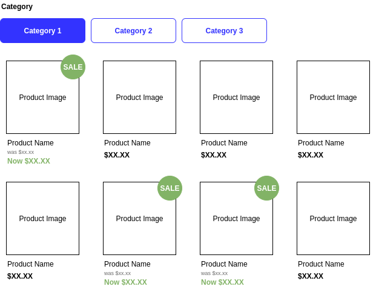

# 

## PETstock Front End Developer Assessment
The goal of assessment is to test you skills JavaScript and SCSS using the VueJS framework. 

We've created a collection of product data for you to work with which can be found in `src/data.json`.

Work should be completed in the `src/App.vue` file. 

The application should display a list of product information and allow the User to filter and sort the results.

### Your Task



* Design: 
    * Refer to `wireframe.png` in project root.
    * Refer to SCSS in `src/App.vue` for mobile breakpoint:
      * Show **two** products per row on **mobile**
      * Show **four** products on **desktop**
* Display product listings:
    * Show image, name, pricing information
    * Links to product view page
    * **For sale items, product should have a sales badge and original RRP**
* Allow the user to: 
    * **Filter** products by **category** or **view all products**.
* Add some comments to this README indicating how long the task took to complete and any other feedback about the work you'd like to share. 

Once you have completed the task, please push your a git repository to a service like GitHub or BitBucket and provide us with a link for review.

### Guidelines
* Avoid using additional frameworks and tools if possible
* If using additional tools, add an explanation for your decision in the feedback section below
* Don't worry about CSS / JS cross browser compatibility. Just ensure the application works in Chrome

### Setup:

Just install npm dependencies and then run serve command:

````bash
$ cd ./fed-vue;
$ yarn | npm install
$ yarn serve | npm run serve
````


## Feedback

### Time taken to complete:

[Add time to complete here]

### General Comments:

[Add general comments here]


### Additional tools used:

[Add notes on additional tools here]